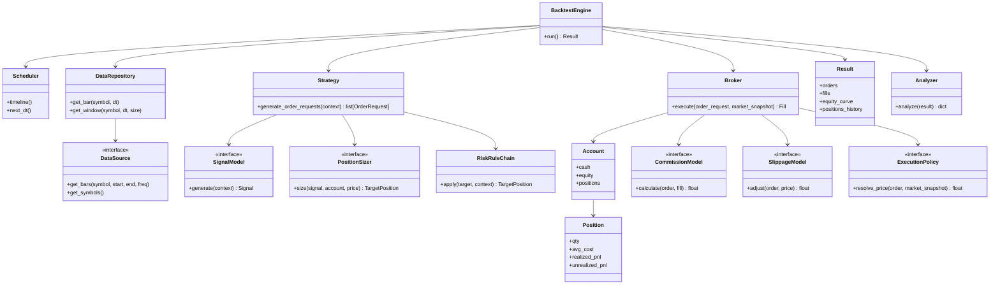
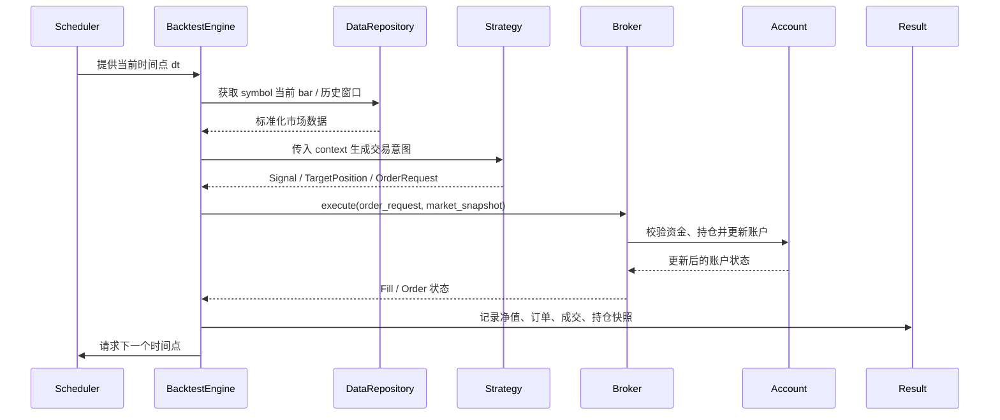

# Python 量化框架架构设计文档

> 目标：构建一套**能长期演进、又不会一开始就过度设计**的 Python 量化框架。

## 1. 设计目标

框架聚焦四项核心能力：

1. **数据获取与标准化**：对不同数据源、不同市场提供统一访问方式。
2. **策略表达**：将信号、仓位、风控拆分为可组合模块。
3. **回测驱动**：统一调度数据、策略、执行，形成闭环。
4. **成交与资金仿真**：订单、持仓、现金、费用、绩效可追踪。

设计原则：

- **单一职责**：每一层只负责一类问题。
- **组合优于继承**：优先通过组合拼装能力，而不是叠加继承层次。
- **接口隔离**：上层只依赖必要接口，不感知底层细节。
- **依赖倒置**：核心流程依赖抽象接口，不依赖具体实现。
- **适度抽象**：初版只为真实变化点做抽象，不预埋过多未来扩展。

## 2. 推荐目录结构

```text
quant/
├── data/
│   ├── datasource.py
│   ├── repository.py
│   ├── schema.py
│   └── loader.py
├── strategy/
│   ├── signal.py
│   ├── portfolio.py
│   ├── rule.py
│   └── context.py
├── execution/
│   ├── order.py
│   ├── broker.py
│   ├── position.py
│   ├── account.py
│   └── transaction.py
├── backtest/
│   ├── engine.py
│   ├── scheduler.py
│   ├── event.py
│   ├── result.py
│   └── analyzer.py
└── common/
    ├── types.py
    ├── exceptions.py
    └── utils.py
```

## 3. 分层职责总览

| 层次 | 核心问题 | 主要输入 | 主要输出 | 不应负责 |
| --- | --- | --- | --- | --- |
| 数据层 | 在某个时点可以提供哪些标准化市场数据 | 原始行情源、文件、数据库、API | `Bar`、`Slice`、标准化 `DataFrame` | 信号计算、订单生成、资金状态 |
| 策略层 | 是否产生交易意图，以及交易意图是什么 | 市场窗口、上下文、账户摘要 | `Signal`、`TargetPosition`、`OrderRequest` | 直接改账户、成交仿真 |
| 执行层 | 交易意图如何在账户层面落地 | `OrderRequest`、行情快照、账户状态 | `Order`、`Fill`、更新后的 `Account`/`Position` | 生成交易信号 |
| 回测层 | 用什么节奏串起数据、策略、执行 | 日历、调度规则、各层对象 | `Result`、绩效分析输入 | 指标细节、手续费细节、策略规则 |

## 4. 模块职责表

### 4.1 数据层

| 模块 | 角色 | 核心职责 | 推荐模式 |
| --- | --- | --- | --- |
| `DataSource` | 数据源抽象接口 | 屏蔽 CSV / Parquet / DB / HTTP API 差异 | Strategy |
| `DataRepository` | 数据访问门面 | 缓存、切片、symbol 校验、重采样、统一访问 | Facade |
| `BarSchema` / `MarketData` | 标准行情结构 | 统一字段命名与数据契约 | 数据模型 |
| `loader.py` | 装载与预处理 | 文件读取、字段映射、基础清洗 | 工具模块 |

**边界约束**：数据层只负责“把数据给你”，不负责“该不该买、能不能买、买完账户怎么变”。

### 4.2 策略层

| 模块 | 角色 | 核心职责 | 推荐模式 |
| --- | --- | --- | --- |
| `SignalModel` | 信号生成器 | 基于历史窗口和上下文输出 `Signal` | Template Method + Strategy |
| `PositionSizer` | 仓位决策器 | 将信号转换为目标数量或目标权重 | Strategy |
| `RiskRule` | 风控规则 | 对交易意图进行拒绝、裁剪、延后或修正 | Chain of Responsibility |
| `Strategy` | 策略聚合门面 | 组合 `SignalModel`、`PositionSizer`、`RiskRuleChain` | Facade |
| `context.py` | 上下文对象 | 持有当前时点、账户摘要、缓存指标等 | 数据模型 |

**边界约束**：策略层只输出“意图”，不能直接改 `cash`、`position`、`equity`。

### 4.3 执行层

| 模块 | 角色 | 核心职责 | 推荐模式 |
| --- | --- | --- | --- |
| `OrderRequest` | 意图订单 | 表达“想怎么下单” | 数据模型 |
| `Order` | 正式订单 | 记录订单状态与标识 | 实体 |
| `Fill` | 成交回报 | 记录成交数量、价格、费用 | 实体 |
| `Position` | 单标的持仓 | 维护数量、均价、浮盈亏、已实现盈亏 | 实体 |
| `Account` | 账户状态 | 维护现金、持仓、市值、净值 | 聚合根 |
| `Broker` | 执行代理门面 | 校验资金与持仓、撮合成交、回写账户 | Facade |
| `CommissionModel` | 费用模型 | 计算手续费、印花税、佣金等 | Strategy |
| `SlippageModel` | 滑点模型 | 调整成交价 | Strategy |
| `ExecutionPolicy` | 成交规则 | 控制 close 成交、next open 成交等 | Strategy |

**边界约束**：执行层只负责“是否可成交、如何成交、成交后状态是什么”，不能反过来决定“该不该买”。

### 4.4 回测层

| 模块 | 角色 | 核心职责 | 推荐模式 |
| --- | --- | --- | --- |
| `BacktestEngine` | 总控引擎 | 初始化环境、驱动主循环、收集结果 | Facade |
| `Scheduler` | 时序调度器 | 提供交易日历、频率控制、时间推进 | 调度器 |
| `event.py` | 轻量事件对象 | 仅在引擎内部表达阶段性事件 | 轻量事件流 |
| `Result` | 结果容器 | 沉淀订单、成交、持仓、净值曲线 | 数据模型 |
| `Analyzer` | 绩效分析器 | 计算收益、回撤、Sharpe、换手等指标 | 单一职责 |

**边界约束**：回测层只编排流程，不内嵌策略规则、费用算法或绩效细节。

## 5. 核心类图



## 6. 典型时序图



## 7. 主链路说明

推荐回测主流程：

1. `Scheduler` 给出当前时间点 `dt`。
2. `DataRepository` 提供当前 `symbol` 的历史窗口与当前 bar。
3. `Strategy` 内部调用 `SignalModel` 生成 `Signal`。
4. `PositionSizer` 将信号转换为目标仓位或订单请求。
5. `RiskRuleChain` 对交易意图进行过滤或修正。
6. `Broker` 按执行策略、滑点、费用规则执行订单。
7. `Account` 与 `Position` 更新现金、持仓与盈亏。
8. `BacktestEngine` 记录净值、订单、成交和持仓快照。
9. 回测结束后由 `Analyzer` 生成绩效分析结果。

可以压缩为一条主链：

```text
数据 -> 信号 -> 仓位 -> 风控 -> 执行 -> 账户更新 -> 结果分析
```

## 8. 设计模式使用建议

仅保留最有价值的模式，避免样板化：

| 设计模式 | 使用位置 | 使用原因 |
| --- | --- | --- |
| Strategy | `DataSource`、`SignalModel`、`PositionSizer`、`CommissionModel`、`SlippageModel`、`ExecutionPolicy` | 同一职责下存在多种算法实现 |
| Facade | `DataRepository`、`Broker`、`BacktestEngine` | 对上层暴露统一入口，隐藏复杂细节 |
| Chain of Responsibility | `RiskRuleChain` | 风控规则天然适合串联与插拔 |
| Template Method | `SignalModel` 基类 | 信号计算存在稳定公共流程 |
| Simple Factory | 数据源 / 策略 / Broker 配置创建 | 轻量初始化不同组合 |

## 9. 抽象边界与反模式提醒

### 必须坚持的边界

1. **数据层不能知道策略。**
2. **策略层不能直接改账户。**
3. **执行层不能产生策略信号。**
4. **回测层只编排，不做业务细节。**

### 初版不建议做的事情

- 完整事件总线（Event Bus / Dispatcher / Subscriber）
- 插件发现系统
- 复杂继承体系（多层 `BaseStrategy` / `CompositeStrategy` 等）
- DDD 式重仓储抽象
- 过早并行化设计

## 10. 建议的最小可用版本（MVP）

### 数据层

- `DataSource`
- `DataRepository`

### 策略层

- `SignalModel`
- `PositionSizer`
- `RiskRule`
- `Strategy`

### 执行层

- `OrderRequest`
- `Order`
- `Fill`
- `Position`
- `Account`
- `Broker`
- `CommissionModel`
- `SlippageModel`

### 回测层

- `Scheduler`
- `BacktestEngine`
- `Result`
- `Analyzer`

## 11. 一句话总结

这套框架的核心思想是：

> **数据层负责“给数据”，策略层负责“做决策”，执行层负责“落交易”，回测层负责“串流程”。**

该设计既保留了清晰分层和策略/执行解耦的优点，又避免了一开始就做成“大而全平台”的过度设计。
